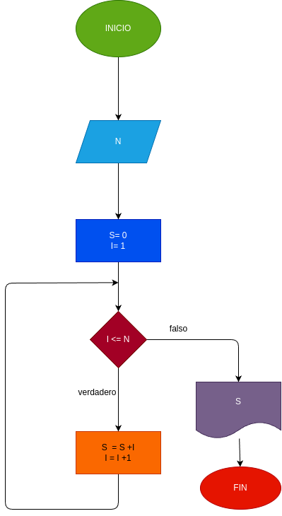

# While_1
primer ejercicio usando While

## Input

N = Numero escogido a sumar

## Proccesing

- S = 0
- I = 1
------------
mientras que I <= N
- S= S + I
- I= I + 1

si I es igual o mayor a N se detiene y da el resultado

## Diseño
